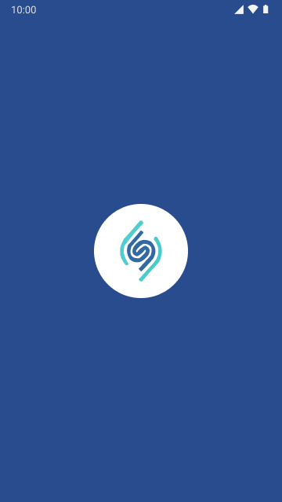
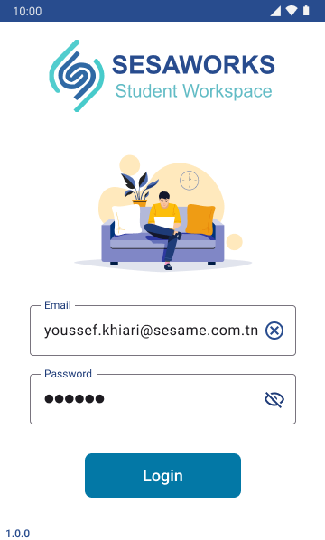
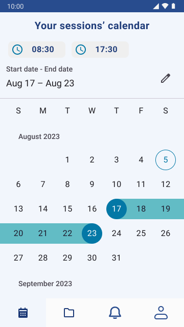
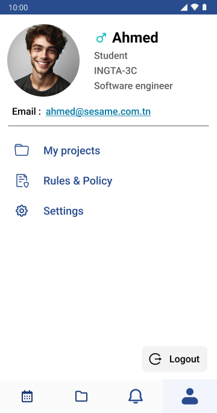
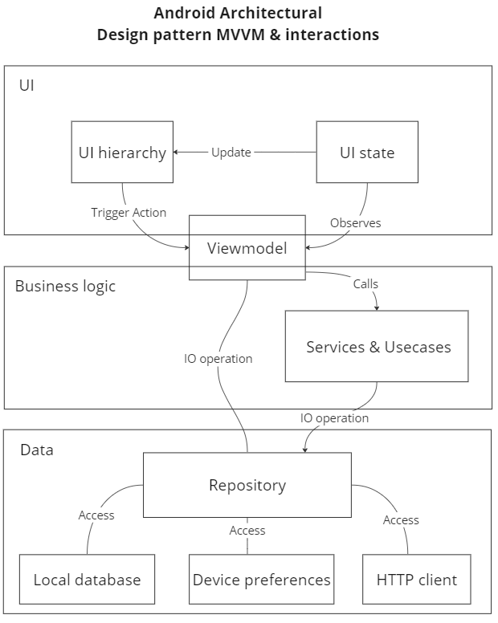

# Sesaworks
A mobile app for Sesame university students to manage their academic projets.
# Note :
More features will be added that are not only confined to managing academic projects but also solving problems students and staff encouter on daily basis.
See the next features UI protoypes [here](https://www.figma.com/file/NLNjgyfvxpEMhJuhmJX12K/SesameStudentLife?type=design&node-id=435%3A3577&mode=design&t=isR2KAcPRgT9X7Ta-1)
## Purpose
This app is built as part of my academic projects but also serves as a sample for a jetpack-compose android app.
As you inspect the code, you will notice that it is a Kotlin multiplatform app but i decided to go android-first because i had issues with compose multiplatform and sqldelight.
* What does this app showcase ?
 - Jetpack compose powered UI supporting dark mode and landscape mode.
 - Creating modular and reusable UI components jetpack compose (Implementing a design system built on top of M3)
 - State management with jetpack compose.
 - MVVM architectural design pattern.
 - The power of Kotlin's asynchronous and reactive programming using Coroutines and flows.
 - Clean architecture 
 - Testing with Junit and compose UI testing API
 - Storing and fetching data from local database using SQlDelight.
 - Making API calls using Ktor Http client.
 - Implementation of a biometric authentication with jetpack compose.

## Figma UI prototype

## Application layers and data flow

## Links & Attributions
User placeholder images:
 Link: https://www.freepik.com/free-vector/anonymous-avatars-grey-circles_44471922.htm#query=placeholder%20avatar&position=0&from_view=keyword&track=ais&uuid=d9cf7813-dc74-4bcc-b5eb-a9e5c6f94109 \
 Author : https://www.freepik.com/author/juicy-fish
